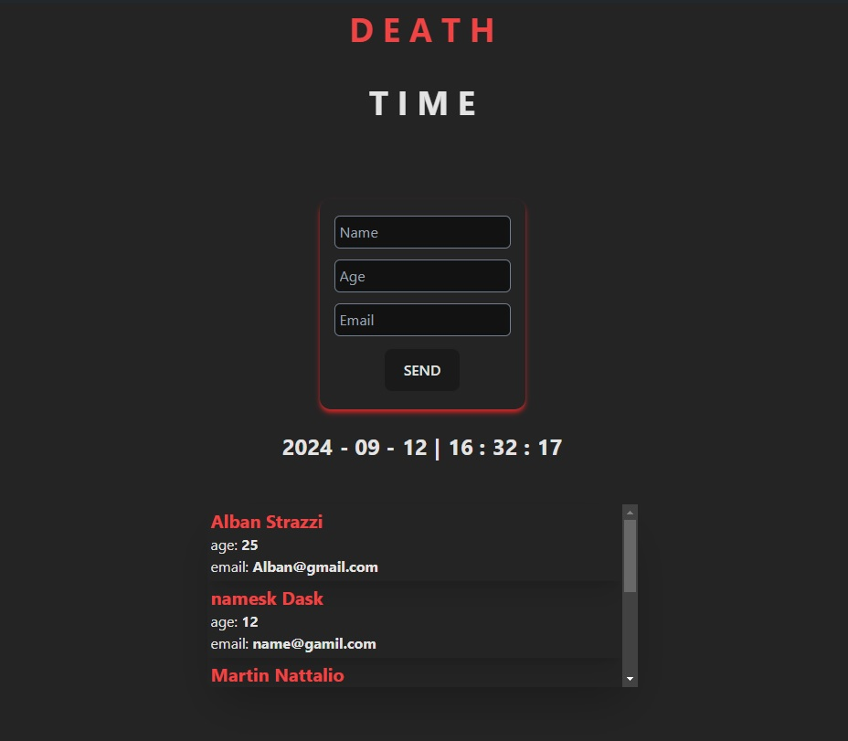

# Death Time Middleware in Client 



This is an example of how the Death Time middleware works.

## Before Installation

Before continuing you will need an API to test DeathTime and configure ```src/app/ui/List.tsx``` 

## Router configure

`` .env.local ``

```
# <<-APIs REST->>

# Express 
#----------------------------------
# Docker
# NEXT_PUBLIC_SERVICE_URL="http://host.docker.internal:3001/api"
#----------------------------------
# Local
# NEXT_PUBLIC_SERVICE_URL="http://localhost:3001/api"
#
#
#
#
#
# ASP.NET
#----------------------------------
# Local
# NEXT_PUBLIC_SERVICE_URL="http://localhost:5024/api"


```

## API

[.NET-API](https://github.com/DMarzzucco/DeathTime.ASP.NET.git)

[Express-API](https://github.com/DMarzzucco/DeathTime.Express-API.git)

## Requirements

* Docker
* Node js (Optional)


## Intallation

```bash 

# Start client
$ npm install
$ npm run dev
``` 

## Port

[localhost:3000](http://localhost:3000)

## Author

Made by Dario Marzzucco (DMarzzucco)
